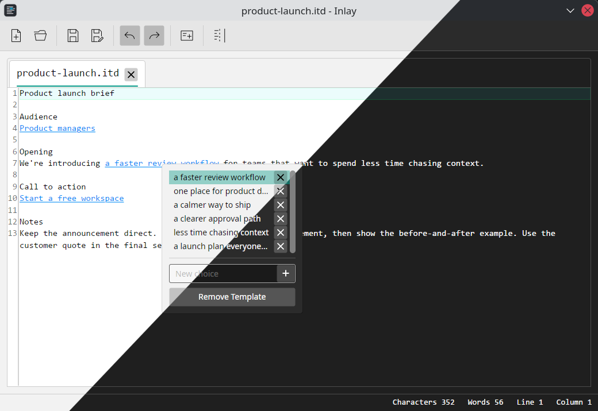

# Inlay

A small templating text editor built on AvaloniaEdit/AvaloniaUI. Inline templates hold a list of choices and show one selected value. Click a template object to edit its choices.



Built as a demo of my prior work with C# and AvaloniaUI.

## Test it

```sh
dotnet run --project Inlay.csproj
```
Or launch through VSCode.

## Architecture

The application follows MVVM, and implements with AvaloniaUI, ReactiveUI, and a customized templating extension built on top of AvaloniaEdit.

## Document format

Files use JSON. Text and templates are stored as ordered parts, so template locations do not depend on character offsets.

```json
{
  "formatVersion": 1,
  "content": [
    { "type": "text", "text": "Hello " },
    {
      "type": "template",
      "options": ["Ada", "Grace"],
      "selectedIndex": 0
    },
    { "type": "text", "text": "!" }
  ]
}
```

`selectedIndex` is `-1` when the template has no active choice. The editor displays `_____` in that case.
